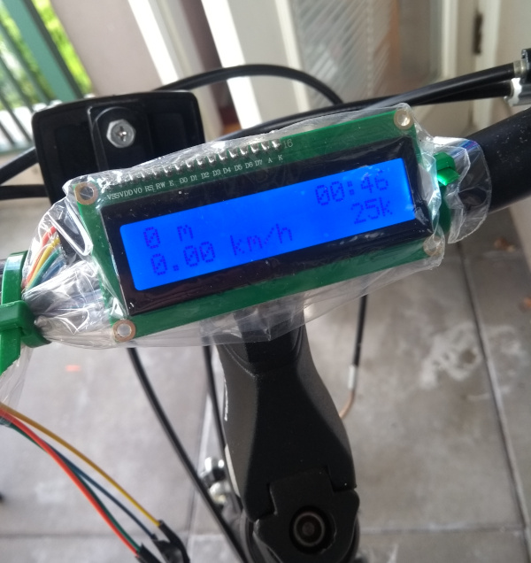
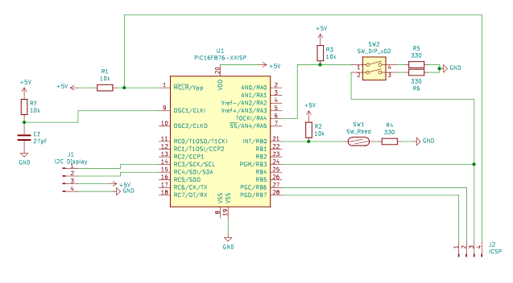

# picodo

Bicycle odometer/speedometer firmware for PIC16F87X.

Designed for a [16x2 HD44780 based character display (with an I2C backpack)](https://www.buydisplay.com/blue-lcd-module-hd44780-16x2-display-character-lcd-i2c-arduino-code). Compiled with SDCC/GPASM.

## Hardware

A magnet is attached to the spokes of the front wheel. A reed switch sits on the fork to count the number of rotations within a given interval.

The first DIP switch (1-4) enables a count in the lower right corner of the display, showing the number of rotations within the rate calculation interval. This is useful for testing the reed switch.

The second switch (2-3) will ground PGM when on. This prevents the PIC from entering programming mode. Turn switch off when using ICSP. Ignore this switch if using low-voltage programming is disabled in the PIC.

## Build

Run `make`. hex/lst files will be located in `bin`.

## Install/Program

Use a PIC programmer or [gpio2pic](https://github.com/djandries/gpio2pic) with a Raspberry Pi to program the firmware onto the PIC.

Erase the first two bytes of the user EEPROM data. This is used to store the odometer count.

When turned on, the trip odometer and trip time can be seen on the top row. This information only persists while the device is on. The bottom row will show the speed and the total odometer. The total odometer will be swapped with the number of rotations if the first DIP switch is enabled.